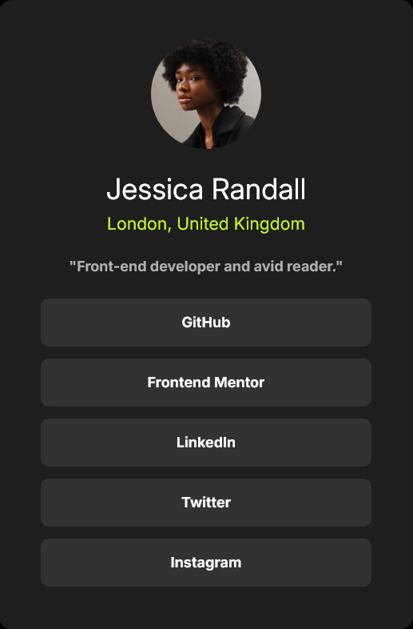

# Frontend Mentor - Social links profile solution

This is a solution to the [Social links profile challenge on Frontend Mentor](https://www.frontendmentor.io/challenges/social-links-profile-UG32l9m6dQ). Frontend Mentor challenges help you improve your coding skills by building realistic projects. 

## Table of contents

- [Overview](#overview)
  - [The challenge](#the-challenge)
  - [Screenshot](#screenshot)
  - [Links](#links)
- [My process](#my-process)
  - [Built with](#built-with)
  - [What I learned](#what-i-learned)
  - [Continued development](#continued-development)
  - [Useful resources](#useful-resources)
- [Author](#author)
- [Acknowledgments](#acknowledgments)

## Overview

This is an HTML & CSS challenge project involving the creation of a social media profile.

### The challenge

Users should be able to:

- Create a social media profile that also links several other social media pages.

### Screenshot

### Links

- Solution URL: [Add solution URL here](https://your-solution-url.com)
- Live Site URL: [Add live site URL here](https://hgb0043.github.io/social-media-project--2/)

## My process

- First, create the index.html file; this will serve as the sole and primary HTML file in the project.

- Create a main.css file; this will serve as the primary css file. If you would like, create a reset.css file for better layout versatility. There are many different reset CSS templates available online. 

- Create the HTML structure. First, create a <main> element that will serve as the container for the profile.
Create four <h> elements embedded in div elements. These will correspond to the profile-picture, name, location, and description.

- Create five links and give them the texts "Github", "Frontend Mentor", "Linkedin", "Twitter", "Instagram", respectively.

- Style the page with traditional CSS to emulate the design as similarly as possible to the solution provided. Do this using the styles provided in the "style-guide.md" file. For the overall layout, I used a flexbox layout, but a grid layout will suffice for a static page.

# Built With

- VS Code
- GitHub
- Semantic HTML5 markup
- Flexbox
- Desktop-first workflow

### What I learned

In this project, I learned that it is best to use various element tags throughout a flexbox layout instead of only using div element tags. For example, here is the opening tag for my 'container' element which embeds the entirety of the social media profile in the HTML document: 

<main id="container">

This principle can also be applied to other parts of an HTML document. For example, here is the code for my attribution at the bottom of my HTML solution: 

<footer class="attribution">
    Challenge by <a href="https://www.frontendmentor.io?ref=challenge" target="_blank">Frontend Mentor</a>. 
    Coded by <a href="https://github.com/hgb0043">Hayes Blackstone</a>.
  </footer>

  These tags, although they are not different to the 
 tag aesthetically, produce code that is much easier to read and provide functional advantages like improved accesibility and better search engine optimization. 

### Continued development

An area I want to continue focusing on is mastering flexbox, which has been very tricky to learn so far but is  invaluable in web design.
This is my main hurdle towards mastering simple page design using HTML & CSS.

### Useful resources

- [| YouTube Video | Full HTML & CSS Full Course - Beginner to Pro ](https://www.youtube.com/watch?v=G3e-cpL7ofc&t=21071s) - I will have to link this in every project I do that has a focus on HTML & CSS because it has been crucial to my development in the two languages. Every beginner frontend developer would greatly benefit by watching and completing the examples and main project in the video. 

- [| YouTube Video | Git, GitHub, & GitHub Desktop for beginners](https://www.youtube.com/watch?v=8Dd7KRpKeaE&t=536s) - This video was recommended when learning the basics in Frontend Mentor but I want to share it just in case anyone missed it. It has been very helpful at teaching me to use GitHub, Github Desktop, and VSCode harmoniously which has been a challenge for me so far in my young journey as a frontend developer. 

## Author

- Frontend Mentor - [@hgb0043](https://www.frontendmentor.io/profile/hgb0043)
- Twitter - [@hgblackstone](https://www.twitter.com/hgblackstone)
- LinkedIn - [Hayes Blackstone] (https://www.linkedin.com/in/hayes-blackstone-a74182352/)

## Acknowledgments

I would like to offer my genuine thanks to Frontend Mentor user @Backpachamame for his comment on my original Frontend Mentor solution post. You offered specific and thorough feedback that did not go unnoticed. It is because of users like you that Frontend Mentor is such a successful and collaborative platform and I aspire to help others like you have helped me on this project. 